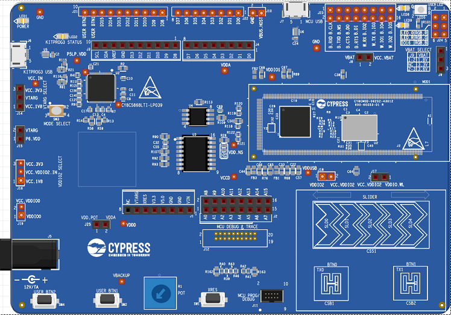

 
 
 
 
 

# CY8CKIT-062S2-43012-Fritzing
Fritzing model of Cypress' CY8CKIT-062S2-43012

  

### About the project
___
I wanted an easy way to plan my breadboard, and more importantly, be able to shre the design before having to get into the schemaic capture phase of the project. This is a great kit to use. I have been using it as the basis of all my home projects.  

### Built With
___

Fritzing Version 0.9.4 Beta. Should work with all others but I have not tried it
Hardware: CY8CKIT-062S2-43012   

### Getting Started
___

#### Using this project
___
Best place to get help on his to include this in your project, refer to the [official Fritzing documentation](https://fritzing.org/parts/)

### Contributing
___
Contributions are what make the open source community such an amazing place to be learn, inspire, and create. Any contributions you make are **greatly appreciated**.

1. Fork the Project
2. Create your Feature Branch (`git checkout -b feature/AmazingFeature`)
3. Commit your Changes (`git commit -m 'Add some AmazingFeature'`)
4. Push to the Branch (`git push origin feature/AmazingFeature`)
5. Open a Pull Request

### License
___
Distributed under the MIT License. See `LICENSE` for more information.

### Contact
___
Project Link: [CY8CKIT-062S2-43012-Fritzing](https://github.com/HElkhoury/CY8CKIT-062S2-43012-Fritzing)

### Acknowledgements
___
* [Img Shields](https://shields.io)
* [Choose an Open Source License](https://choosealicense.com)
* [GitHub Pages](https://pages.github.com)

### End
